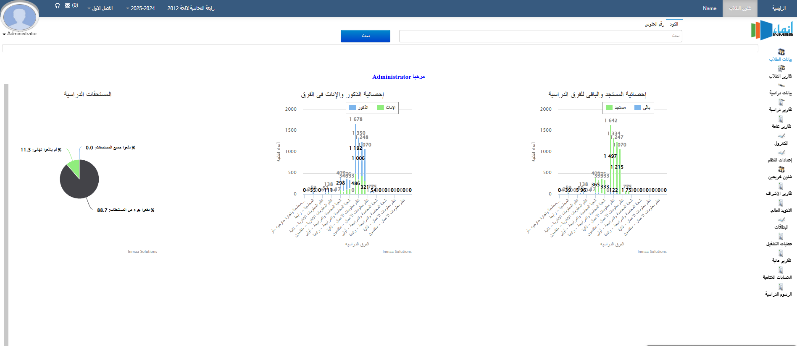

# Academic Management System

A system to manage student credits, course registration, academic records, and transcripts for universities and training centers.

---

## Overview
**Industry:** Education  
**Role:** Lead Developer & System Architect  
**Users:** University staff, students, and administration  

### Business Problem
Universities and training centers faced challenges such as:  
- Fragmented student registration and course management  
- Difficulty tracking academic progress and transcripts  
- Manual processes for credit allocation and reporting  
- Inefficient communication between departments  

---

## Key Features
- Student registration and course enrollment  
- Credit tracking and academic progress monitoring  
- Generation of official transcripts and grade reports  
- Role-based access (students, instructors, admin staff)  
- Notifications and workflow automation for registration deadlines  

---

## Architecture & Technologies
- **Backend:** C# ASP.NET MVC  
- **Database:** SQL Server  
- **Frontend:** Bootstrap 5, HTML5, CSS3, JS  
- **Design Patterns:** MVC, Repository Pattern, SOLID Principles  
- **Deployment / Hosting:** Windows Server / IIS  

>   
> *Placeholder for system architecture diagram*

---

## Key Achievements
- Designed a modular MVC architecture for easy maintenance and feature expansion  
- Implemented a secure role-based system for staff and student access  
- Automated transcript generation, reducing administrative workload  
- Optimized SQL queries for fast reporting and large datasets  

---

## Impact
- Streamlined student registration and course management  
- Improved accuracy of academic records and transcripts  
- Reduced manual administrative tasks by 40%  
- Scalable system ready for multi-department universities  

---

## Screenshots / Demo
>   
> *Placeholder for system dashboard screenshot*

---

## Note on Source Code
This project can be shared as architecture and design showcase.  
Source code is proprietary; details can be discussed with interested parties.

---

## Contact
🔗 [LinkedIn](https://www.linkedin.com/in/ahmed-barakat-8b7b9922/)  
🔗 [GitHub](https://github.com/ahmedbarkat)
